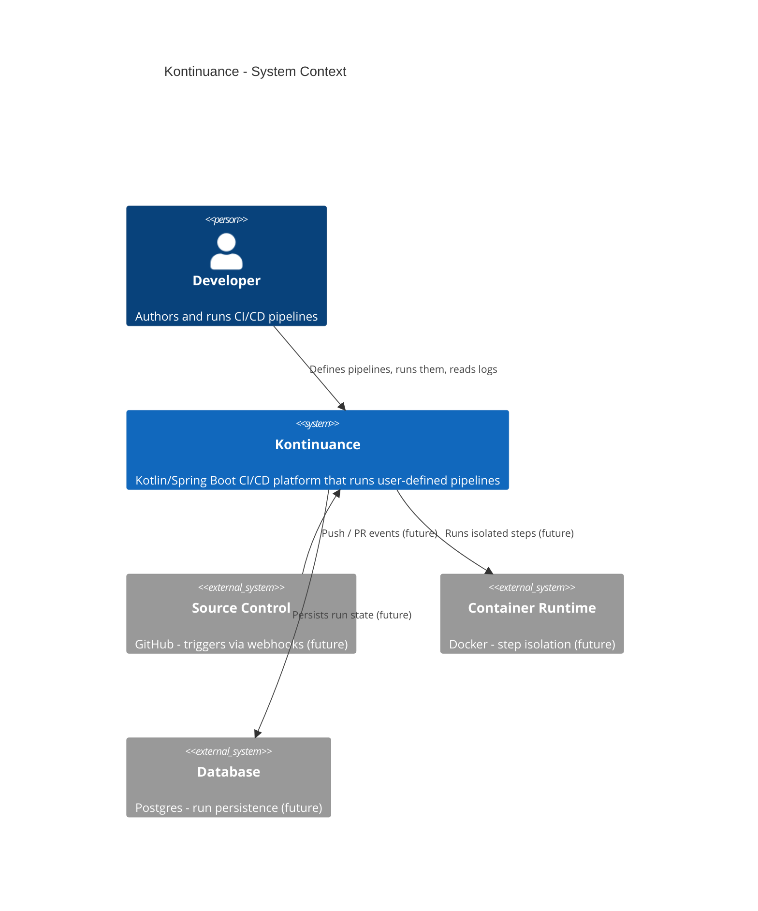
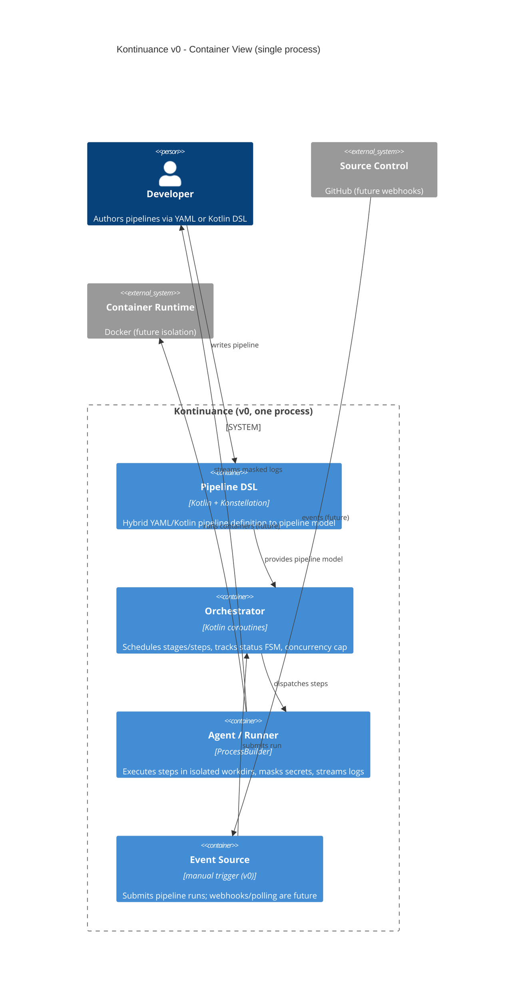

# C4 — Context & Container Views

Kontinuance's architecture follows the overview's three-plane split — Orchestrator,
Agent/Runner, Event Source — kept as separate concerns even though **v0 runs them in
a single process**. External systems and planes that arrive in later phases are
marked *(future)*.

## System Context

## Container View (v0, single process)

Related: [`overview.md`](../overview.md) and [`plan.md`](../../specs/001-pipeline-foundation/plan.md).
