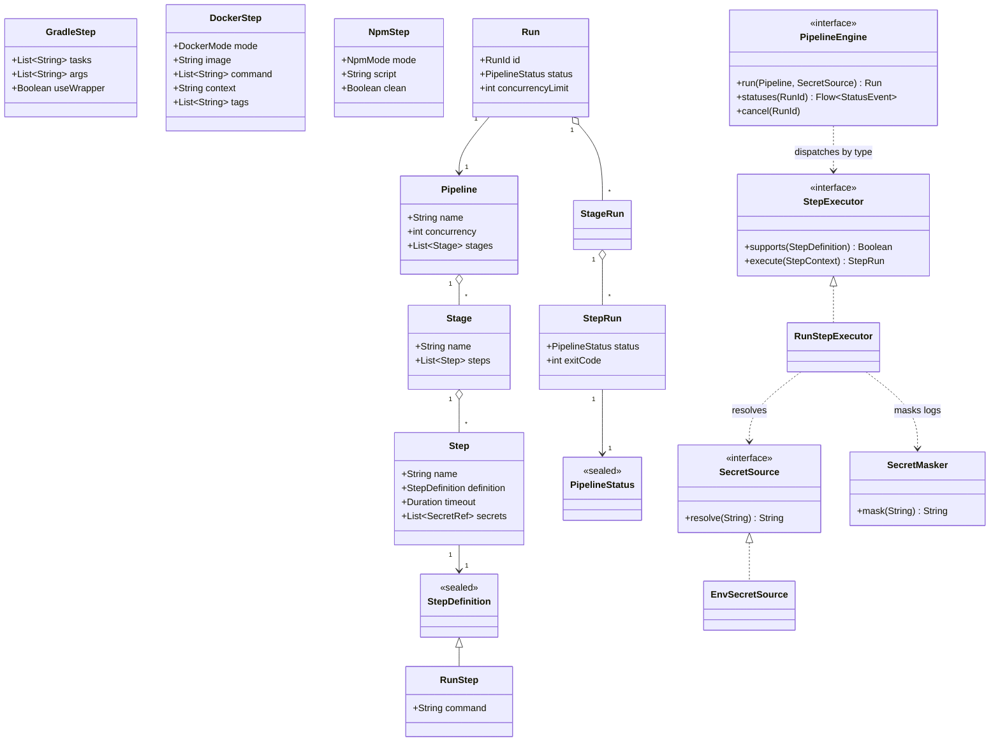

# Class Diagram — v0 Engine Model

The runtime model both front-ends produce and the engine consumes. Note the
**step-type extensibility seam**: `StepDefinition` is a sealed hierarchy and
`StepExecutor` dispatches by type. v0 shipped one type (`RunStep`); feature 002 adds
`GradleStep`/`DockerStep`/`NpmStep` and their executors **additively** — every command
executor shares the `ProcessStepExecutor` base (identical isolation, timeout, masking,
and status), and the engine's core loop is unchanged.

Related: [`data-model.md`](../../specs/001-pipeline-foundation/data-model.md).
