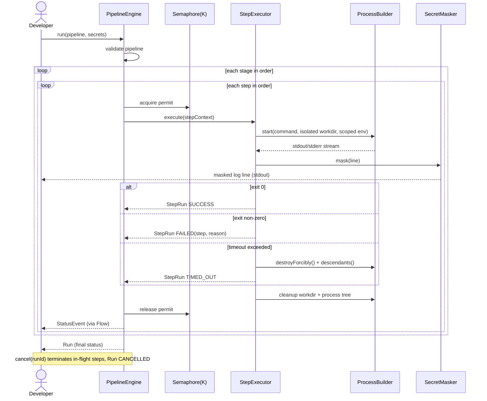

# Sequence — Pipeline Run Execution (v0)

One execution of a pipeline: ordered stages/steps, concurrency-gated step launches,
isolated `ProcessBuilder` execution, secret-masked log streaming, and the
timeout/cancel paths.

Related: [`contracts/dsl-and-engine-api.md`](../../specs/001-pipeline-foundation/contracts/dsl-and-engine-api.md).
