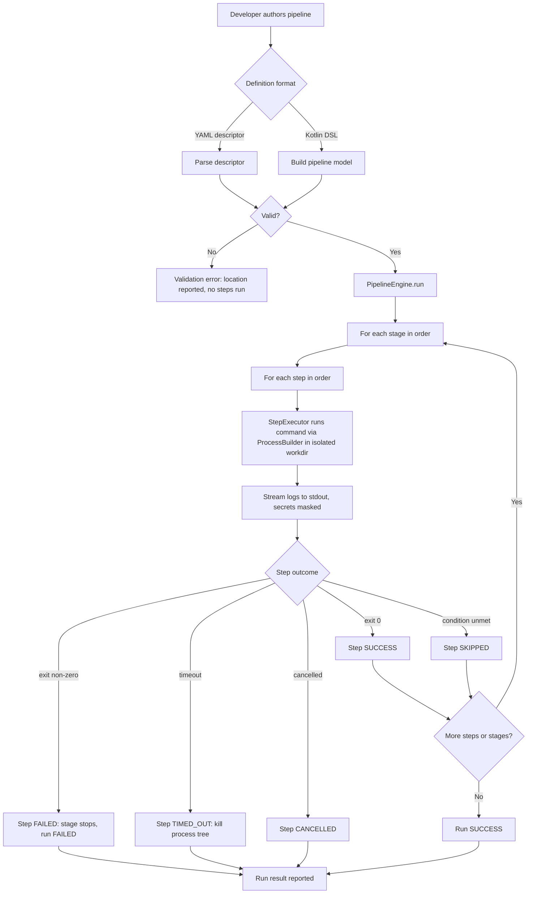

# User Flow — Defining & Running a Pipeline (v0)

How a developer goes from a pipeline definition to a result in Kontinuance v0.
Both definition front-ends (YAML descriptor, Kotlin DSL) converge on one model and
one execution engine.

Related: [`spec.md`](../../specs/001-pipeline-foundation/spec.md) user stories US1–US3.
